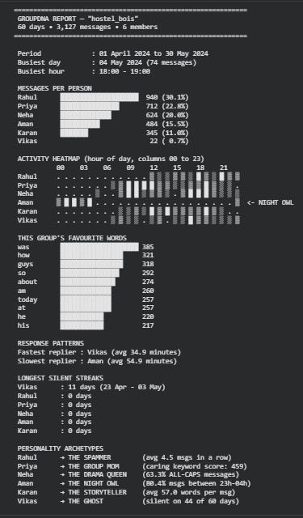

# GroupDNA_Whatsapp_Chat_Analyzer

*A Python tool that decodes WhatsApp group chats and generates a beautifully formatted, terminal-style analytics report.*

## 📌 Project Overview
GroupDNA is a behavioral analytics parser designed to analyze WhatsApp export `.txt` files. It reads messy, raw messaging data, cleans it, and outputs a visual report detailing group activity, the most active participants, response speed, silent streaks, and individual personality archetypes (e.g., "The Night Owl", "The Group Mom"). 

## 🛑 The Constraints (Why this project is different)
Anyone can throw libraries at a problem, but this project was built entirely under **strict constraints** to demonstrate discipline and a strong grasp of fundamentals.

**What I allowed myself to use:**
- Core Python fundamentals (loops, dictionaries, functions, string methods).
- `numpy` (specifically for building the matrix powering the activity heatmap).
- `datetime` (for calculating response times and identifying longest silent streaks).

**What was strictly forbidden:**
- `pandas` (No DataFrames, no `read_csv`).
- `matplotlib` / `seaborn` / `plotly` (All visualizations and heatmaps are text-based and rendered using block characters in the console).
- `re` (Regex) and AI/ML NLP libraries (e.g., `nltk`). All pattern matching and tokenization were handled manually via standard string operations.
- Shortcuts like `collections.Counter` or `collections.defaultdict`.

## 🛠️ The 7-Day Build Log
- **Day 1 - Setup & Parser:** Built a robust parser to handle 5 different edge cases (system messages, deleted texts, omitted media, multi-line entries, and hidden unicode spaces).
- **Day 2 - Group Overview:** Implemented logic to calculate total messages, date ranges, and rank participants by activity level.
- **Day 3 - Top Words:** Tokenized messages, stripped punctuation, and built a custom dictionary-based counter (excluding stop-words) to generate ASCII bar charts for top vocabulary.
- **Day 4 - NumPy Heatmap:** Constructed a 6x24 NumPy matrix mapping participants against hours of the day, rendering the output dynamically with block-shading characters.
- **Day 5 - Response & Streaks:** Leveraged `datetime` to compute average reply speeds and calculate the longest consecutive streak of silent days per participant.
- **Day 6 - Archetype Detection:** Engineered 8 default algorithmic personality detection rules + 1 custom archetype ("The Weekend Warrior") and built an assignment system to map each participant to their highest-scoring exclusive archetype.
- **Day 7 - Polish:** Formatted the entire console output using f-strings and box-drawing characters for a premium "screenshot-ready" aesthetic.

## 🚀 How to Run the Code
1. Clone this repository or open the `GroupDNA_Priyam_Bidhan.ipynb` notebook directly in Google Colab.
2. Export any WhatsApp group chat (Without Media) from your phone to get a `.txt` file.
3. Run the very first cell in the notebook. You will be prompted to upload your `.txt` file.
4. Go to **Runtime > Run all** in the top menu.
5. Scroll down to see the final formatted report generated perfectly for your group!
